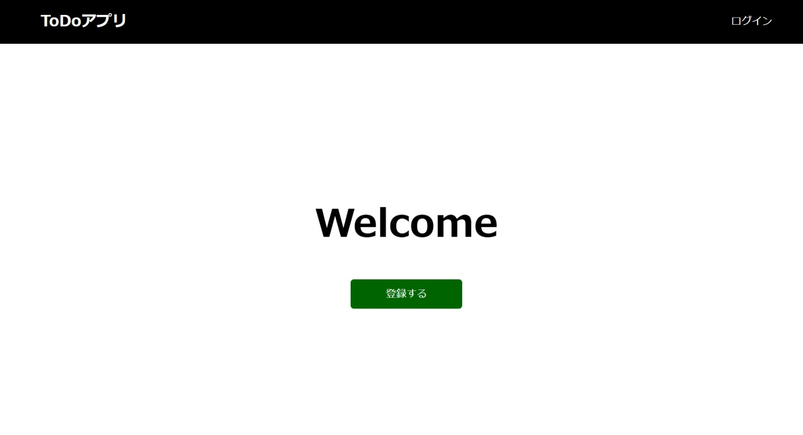

# ToDoアプリの仕様説明

事前に決めているToDoアプリの仕様は、次のとおりです。

## 機能

ToDoアプリは、ToDoを管理するためのサービスを提供するため、次の機能を実現します。

- ToDoを登録できる
- 登録しているToDoを一覧形式で表示できる
- ToDoを完了にできる
- ToDoの完了を取り消せる
- ToDoを削除できる
- 表示するToDoを絞り込むことができる

サービスは複数のユーザーが利用できる想定とし、ユーザーは自身が登録したToDoを操作できます。サービスを利用するためには、アカウントを登録してユーザー認証を行う必要があります。

## 画面構成・デザイン

画面構成およびデザインは、次のとおりです。デザインモックは`spa-restapi-handson/design-mock`に配置しています。

### トップページ

### サインアップページ

### ログインページ

### ToDoページ

## アプリ構成

フロントエンドをSPA、バックエンドをREST APIを提供するアプリで作成し、ユーザーの操作に応じて必要なタイミングで連携することで、それぞれの機能を実現します。

フロントエンドのSPAを実装するためにはReactを使用し、プロジェクトの作成にはCreate React Appを使用します。開発言語にはJavaScriptをそのまま利用せず、JavaScriptを拡張したTypeScriptを使用します。

バックエンドのREST APIは、NablarchのRESTfulウェブサービスを使用して作成します。

フロントエンドとバックエンドの開発については、実際の開発プロジェクトで開発チームが分かれる可能性を考慮し、それぞれを独立して順に開発していきます。そこで、フロントエンドとバックエンドの境界となるREST APIについては、OpenAPIを用いてドキュメント化します。そうすることで、REST APIのクライアントコードやモックを自動生成できるようにし、一貫性を保ちやすくします。そのため、それぞれの機能の開発については基本的に次のステップで進めます。

1. REST APIのドキュメント化
1. フロントエンドの開発
1. バックエンドの開発
1. フロントエンドとバックエンドを結合し、End-to-End（以下E2E）で動作確認

## REST API

### ToDo管理

ToDoを管理するため、次のREST APIを提供します。

REST APIでは、URIでリソースを表現し、HTTPメソッドでそれに対する操作を表現します。ここでは、「ToDo」をリソースとし、ToDoの集合を`/todos`、集合の中の1つのToDoを`/todos/{id}`として表現します。

また、機能や画面から、ToDoの属性として次の項目を用意します。

- ToDoを識別するためのID
- ToDoの内容
- ToDoの状態

なお、バックエンドのアプリでは、REST APIのリクエストであることを識別するため、パスを`/api`で始めるルールとなるように設定します。

これらから、ToDoを操作するためのREST APIは、次のとおりとします。

| HTTPメソッド | パス | 説明 | リクエスト | レスポンス |
| ------- | ------- | ------- | ------- | ------- |
| GET | /api/todos | ToDoを全て取得する | - | ToDoの一覧 |
| POST | /api/todos | ToDoを新しく登録する | ToDoの内容 | 登録したToDo |
| PUT | /api/todo/{id} | ToDoの状態を更新する | ToDoの状態 | 更新したToDo |
| DELETE | /api/todo/{id} | ToDoを削除する | - | - |

### ユーザー認証

ユーザーを認証するためのREST APIを提供するため、REST APIを定義します。

REST APIでは状態を持たないことが基本的な考えであり、状態を扱うユーザー認証では何をリソースと捉えてどのような操作にするのかを考えるのが難しくなります。そのため、ここではリソースとそれに対する操作という基本的な考え方には則らず、実現したい操作に着目し、URIで操作を表現し、HTTPメソッドは`POST`で実行指示を表現するようにします。

これらから、ユーザー認証を行うためのREST APIは、次のとおりとします。

| HTTPメソッド | パス | 説明 | リクエスト | レスポンス |
| ------- | ------- | ------- | ------- | ------- |
| POST | /api/signup | アカウントを新しく登録する | アカウント情報 | - |
| POST | /api/login | ログインする | アカウント情報 | - |
| POST | /api/logout | ログアウトする | - | - |

### CSRF対策

Nablarchでは、クロスサイト・リクエスト・フォージェリ（以下CSRF）に対策するための機能が提供されています。（参考：[CSRF | 安全なウェブサイトの作り方](https://www.ipa.go.jp/security/vuln/websecurity-HTML-1_6.html)）

この機能は、CSRFトークンを発行してリクエスト毎にサーバーサイド側で保持してるCSRFトークンと突き合わせる方式であるため、使用するCSRFトークンを取得するためのREST APIを用意します。

| HTTPメソッド | パス | 説明 | リクエスト | レスポンス |
| ------- | ------- | ------- | ------- | ------- |
| GET | /api/csrf_token | CSRFトークンを取得する | - | - |
