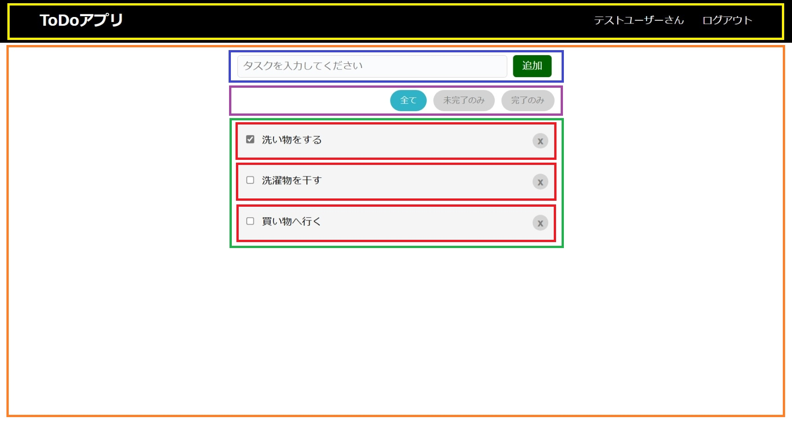

# コンポーネントの分割

ToDoページをコンポーネントに分割します。

## コンポーネントへの落とし込み

次に、ToDoページをどのようなコンポーネント構造にするかを考え、コンポーネントに落とし込んでいきます。

ToDoページのデザインから、コンポーネントの階層構造に落とし込んでいきます。（参考：[React - Reactの流儀 Step 1](https://ja.reactjs.org/docs/thinking-in-react.html#step-1-break-the-ui-into-a-component-hierarchy)）

扱う情報の種類や用途から、ここでは以下のようにコンポーネントに分割します。



- **NavigationHeader**（黄色）：ナビゲーションメニューのヘッダ
- **TodoBoard**（オレンジ色）：ToDoを扱うエリア
- **TodoForm**（青色）：新しいToDoを入力する
- **TodoFilter**（紫色）：ToDoの表示対象を選択する
- **TodoList**（緑色）：ToDoを一覧形式で表示する
- **TodoItem**（赤色）：ToDoを1行で表示する

これらのコンポーネントを、以下のような階層構造で作成していきます。

- NavigationHeader
- TodoBoard
  - TodoForm
  - TodoFilter
  - TodoList
    - TodoItem

## コンポーネントの作成

コンポーネントを作成するディレクトリとして、`src`の下に`components`ディレクトリを作成し、そこにコンポーネントを作成していきます。

ここでは、現在表示している静的なデータをそのまま使用して、それぞれのコンポーネントを作成していきます。（参考：[React - Reactの流儀 Step 2](https://ja.reactjs.org/docs/thinking-in-react.html#step-2-build-a-static-version-in-react)）

Reactのコンポーネントには「関数コンポーネント」と「クラスコンポーネント」の2種類が存在します。（参考：[React - コンポーネントとprops](https://ja.reactjs.org/docs/components-and-props.html)）

関数コンポーネントはクラスコンポーネントの後に登場し、コンポーネントを実装する際の第一候補になることを目指して開発されています。（参考：[React - フックに関するよくある質問](https://ja.reactjs.org/docs/hooks-faq.html#should-i-use-hooks-classes-or-a-mix-of-both)）

ハンズオンで作成するコンポーネントは関数コンポーネントの機能で実装することが可能であるため、すべて関数コンポーネントとして作成していきます。

また、CSSファイルもそれぞれのコンポーネント単位に分割していきます。


`import`で読み込んだCSSファイルの適用範囲は、そのコンポーネント内だけでなく、全てのコンポーネント（グローバル）に適用されます。

そのため、この方法ではコンポーネント単位にCSSファイルを分けておく必要自体はありませんが、コンポーネント単位に分けることで、コンポーネント単位で取り回しがしやすかったり、適用範囲がコンポーネント単位になるような他の方法へ移行しやすくなる、といったメリットがあります。ただし、全体を把握しづらくなるため、予期せずスタイルが衝突してデザインが崩れてしまう、といったような事故が発生しやすいといったデメリットもあります。

ここでは、こういった事故を防ぐための配慮として、基本的にはクラス名を起点としたスタイル定義にして、クラス名の命名ルールを**`[コンポーネント名]_[任意文字列]`**とします。これにより、他のコンポーネントとクラス名が衝突することを防ぎ、事故が起きづらいようにしておきます。なお、デザインモックではすでにこのルールに則ったクラス名を使用しているため、デザインモックのCSSをそのまま使っていきます。


### NavigationHeader

`NavigationHeader`コンポーネントを作成するため、`NavigationHeader.tsx`を作成します。`NavigationHeader`が使用するCSSも分割するため、`NavigationHeader.css`も作成します。

`NavigationHeader`が返すReact要素には、`App`から該当部分を抽出します。

`src/components/NavigationHeader.tsx`
```jsx
import React from 'react';
import './NavigationHeader.css';

export const NavigationHeader: React.FC = () => {
  return (
    <header className="PageHeader_header">
      <h1 className="PageHeader_title">Todoアプリ</h1>
      <nav>
        <ul className="PageHeader_nav">
          <li>テストユーザさん</li>
          <li>ログアウト</li>
        </ul>
      </nav>
    </header>
  );
};
```

`src/components/NavigationHeader.css`
```css
.PageHeader_header {
  display: flex;
  justify-content: space-between;
  align-items: center;
  padding: 0 5%;
  border-bottom: solid 1px black;
  background: black;
}
.PageHeader_title {
  color: white;
  font-size: 1.5rem;
}
.PageHeader_header a {
  text-decoration: none;
}
.PageHeader_nav {
  display: flex;
  list-style: none;
}
.PageHeader_nav li {
  margin-left: 30px;
  color: white;
}
.PageHeader_nav a {
  color: white;
}
.PageHeader_nav button,
.PageHeader_nav button:active,
.PageHeader_nav button:hover
{
  cursor: pointer;
  border: 0;
  background-color: transparent;
  color: white;
}
```

`NavigationHeader`では、TypeScriptの構文を使用して`NavigationHeader`の型に`React.FC`を指定しています。`React.FC`は、Reactが提供している関数コンポーネントを表す型になります。TypeScriptでは`変数:型`というような構文で、型を付けることができます。

```js
export const NavigationHeader: React.FC = () => {
}
```

`NavigationHeader`が作成できたら、`App`で`NavigationHeader`を使用するように修正します。

`src/App.tsx`
```jsx
import React from 'react';
import './App.css';
import { NavigationHeader } from './components/NavigationHeader';

function App() {
  return (
    <React.Fragment>
      <NavigationHeader />
      <div className="TodoBoard_content">
      ...
      </div>
    </React.Fragment>
  );
}

export default App;
```

また、`App.css`から`NavigationHeader.css`に抽出した定義を削除します。

この時点でページの表示内容を確認すると、何も変わらず表示されていることを確認します。これで`App`から`NavigationHeader`部分の抽出は完了です。

### TodoBoard

`TodoBoard`コンポーネントを作成するため、`TodoBoard.tsx`を作成します。`TodoBoard`が使用するCSSを分割するため、`TodoBoard.css`も作成します。

`TodoBoard`が返すReact要素には、`App`から該当部分を抽出します。このコンポーネントにはいくつかの子コンポーネントがありますが、少しずつ確認していくため、一度に作り込まずに一旦このコンポーネントで全て定義し、その後に分割していきます。

`src/components/TodoBoard.tsx`
```jsx
import React from 'react';
import './TodoBoard.css';

export const TodoBoard: React.FC = () => {
  return (
    <div className="TodoBoard_content">
      <div className="TodoForm_content">
        <form className="TodoForm_form">
          <div className="TodoForm_input">
            <input type="text" placeholder="タスクを入力してください" />
          </div>
          <div className="TodoForm_button">
            <button type="button">追加</button>
          </div>
        </form>
      </div>
      <div className="TodoFilter_content">
        <button className="TodoFilter_buttonSelected">全て</button>
        <button className="TodoFilter_buttonUnselected">未完了のみ</button>
        <button className="TodoFilter_buttonUnselected">完了のみ</button>
      </div>
      <ul className="TodoList_list">
        <li className="TodoItem_item">
          <div className="TodoItem_todo">
            <label>
              <input type="checkbox" className="TodoItem_checkbox" checked={true} />
              <span>洗い物をする</span>
            </label>
          </div>
          <div className="TodoItem_delete">
            <button className="TodoItem_button">x</button>
          </div>
        </li>
        <li className="TodoItem_item">
          <div className="TodoItem_todo">
            <label>
              <input type="checkbox" className="TodoItem_checkbox" />
              <span>洗濯物を干す</span>
            </label>
          </div>
          <div className="TodoItem_delete">
            <button className="TodoItem_button">x</button>
          </div>
        </li>
        <li className="TodoItem_item">
          <div className="TodoItem_todo">
            <label>
              <input type="checkbox" className="TodoItem_checkbox" />
              <span>買い物へ行く</span>
            </label>
          </div>
          <div className="TodoItem_delete">
            <button className="TodoItem_button">x</button>
          </div>
        </li>
      </ul>
    </div>
  );
};
```

`src/components/TodoBoard.css`
```css
.TodoBoard_content {
  margin-top: 10px;
  width: 40%;
  padding: 0 30%;
}

.TodoForm_content {
  margin-top: 20px;
  margin-bottom: 20px;
}
.TodoForm_form {
  width: 100%;
  display: flex;
  justify-content: space-between;
}
.TodoForm_input {
  width: 86%;
}
.TodoForm_input input{
  float: left;
  width: 95%;
  border-radius: 5px;
  padding: 8px;
  border: solid 1px lightgray;
  background-color: #fafbfc;
  font-size: 16px;
  outline: none;
}
.TodoForm_input input:focus {
  background-color: white;
}
.TodoForm_button {
  text-align: center;
  width: 14%;
}
.TodoForm_button button {
  height: 35px;
  cursor: pointer;
  line-height: 1;
  font-size: 1rem;
  color: white;
  background-color: darkgreen;
  border-radius: 5px;
  padding: 0 15px;
  border: none;
  vertical-align: middle;
}
.TodoForm_button button:hover {
  background-color: green;
}

.TodoFilter_content {
  text-align: right;
}
.TodoFilter_content button{
  margin-left: 5px;
}
.TodoFilter_buttonSelected {
  background-color: #31b3c7;
  border-width: 0;
  color: #fff;
  cursor: pointer;
  justify-content: center;
  padding: 7px 16px;
  text-align: center;
  white-space: nowrap;
  border-radius: 290486px;
  outline: none;
}
.TodoFilter_buttonUnselected {
  background-color: lightgray;
  border-width: 0;
  color: gray;
  cursor: pointer;
  justify-content: center;
  padding: 7px 16px;
  text-align: center;
  white-space: nowrap;
  border-radius: 290486px;
  outline: none;
}

.TodoList_list {
  list-style: none;
  padding: 0;
  margin: 20px 0;
}

.TodoItem_item {
  padding: 15px 10px;
  background: whitesmoke;
  margin-bottom: 10px;
}
.TodoItem_todo {
  float: left;
  text-align: left;
}
.TodoItem_checkbox {
  margin-right: 7px;
  outline: none;
}
.TodoItem_delete {
  text-align: right;
}
.TodoItem_button {
  font-size: 17px;
  font-weight: bold;
  border: none;
  color: grey;
  background: lightgrey;
  border-radius: 100%;
  width: 25px;
  height: 25px;
  line-height: 20px;
  cursor: pointer;
  outline: none;
}
```

`TodoBoard`が作成できたら、`App`で`TodoBoard`を使用するように修正します。

`src/App.tsx`
```jsx
import React from 'react';
import './App.css';
import { NavigationHeader } from './components/NavigationHeader';
import { TodoBoard } from './components/TodoBoard';

function App() {
  return (
    <React.Fragment>
      <NavigationHeader />
      <TodoBoard />
    </React.Fragment>
  );
}

export default App;
```

また、`App.css`から`TodoBoard.css`に抽出した定義を削除します。

ページの表示内容を確認すると、何も変わらず表示されていることを確認します。これで`App`から`TodoBoard`部分の抽出は完了です。

### TodoForm

`TodoBoard`コンポーネントをさらに子コンポーネントに分割するため、`TodoForm.tsx`を作成します。`TodoForm`が使用するCSSを分割するため、`TodoForm.css`も作成します。

`TodoForm`が返すReact要素には、`TodoBoard`から該当部分を抽出します。

`src/components/TodoForm.tsx`
```jsx
import React from 'react';
import './TodoForm.css';

export const TodoForm: React.FC = () => {
  return (
    <div className="TodoForm_content">
      <form className="TodoForm_form">
        <div className="TodoForm_input">
          <input type="text" placeholder="タスクを入力してください" />
        </div>
        <div className="TodoForm_button">
          <button type="button">追加</button>
        </div>
      </form>
    </div>
  );
};
```

`src/components/TodoForm.css`
```css
.TodoForm_content {
  margin-top: 20px;
  margin-bottom: 20px;
}
.TodoForm_form {
  width: 100%;
  display: flex;
  justify-content: space-between;
}
.TodoForm_input {
  width: 86%;
}
.TodoForm_input input{
  float: left;
  width: 95%;
  border-radius: 5px;
  padding: 8px;
  border: solid 1px lightgray;
  background-color: #fafbfc;
  font-size: 16px;
  outline: none;
}
.TodoForm_input input:focus {
  background-color: white;
}
.TodoForm_button {
  text-align: center;
  width: 14%;
}
.TodoForm_button button {
  height: 35px;
  cursor: pointer;
  line-height: 1;
  font-size: 1rem;
  color: white;
  background-color: darkgreen;
  border-radius: 5px;
  padding: 0 15px;
  border: none;
  vertical-align: middle;
}
.TodoForm_button button:hover {
  background-color: green;
}
```

`TodoForm`が作成できたら、`TodoBoard`で`TodoForm`を使用するように修正し、`TodoBoard.css`から`TodoForm.css`に抽出した定義を削除します。

ページの表示内容を確認すると、何も変わらず表示されていることを確認します。これで`TodoBoard`から`TodoForm`部分の抽出は完了です。

### TodoFilter

`TodoBoard`コンポーネントをさらに子コンポーネントに分割するため、`TodoFilter.tsx`を作成します。`TodoFilter`が使用するCSSを分割するため、`TodoFilter.css`も作成します。

`TodoFilter`が返すReact要素には、`TodoBoard`から該当部分を抽出します。

`src/components/TodoFilter.tsx`
```jsx
import React from 'react';
import './TodoFilter.css';

export const TodoFilter: React.FC = () => {
  return (
    <div className="TodoFilter_content">
      <button className="TodoFilter_buttonSelected">全て</button>
      <button className="TodoFilter_buttonUnselected">未完了のみ</button>
      <button className="TodoFilter_buttonUnselected">完了のみ</button>
    </div>
  );
};
```

`src/components/TodoFilter.css`
```css
.TodoFilter_content {
  text-align: right;
}
.TodoFilter_content button{
  margin-left: 5px;
}
.TodoFilter_buttonSelected {
  background-color: #31b3c7;
  border-width: 0;
  color: #fff;
  cursor: pointer;
  justify-content: center;
  padding: 7px 16px;
  text-align: center;
  white-space: nowrap;
  border-radius: 290486px;
  outline: none;
}
.TodoFilter_buttonUnselected {
  background-color: lightgray;
  border-width: 0;
  color: gray;
  cursor: pointer;
  justify-content: center;
  padding: 7px 16px;
  text-align: center;
  white-space: nowrap;
  border-radius: 290486px;
  outline: none;
}

```

`TodoFilter`が作成できたら、`TodoBoard`で`TodoFilter`を使用するように修正し、`TodoBoard.css`から`TodoFilter.css`に抽出した定義を削除します。

ページの表示内容を確認すると、何も変わらず表示されていることを確認します。これで`TodoBoard`から`TodoFilter`部分の抽出は完了です。

### TodoList

`TodoBoard`コンポーネントをさらに子コンポーネントに分割するため、`TodoList.tsx`を作成します。`TodoList`が使用するCSSを分割するため、`TodoList.css`も作成します。

`TodoList`が返すReact要素には、`TodoBoard`から該当部分を抽出します。このコンポーネントにはいくつかの子コンポーネントがありますが、`TodoBoard`作成時と同様、一旦このコンポーネントで全て定義し、その後に分割していきます。

`src/components/TodoList.tsx`
```jsx
import React from 'react';
import './TodoList.css';

export const TodoList: React.FC = () => {
  return (
    <ul className="TodoList_list">
      <li className="TodoItem_item">
        <div className="TodoItem_todo">
          <label>
            <input type="checkbox" className="TodoItem_checkbox" checked={true} />
            <span>洗い物をする</span>
          </label>
        </div>
        <div className="TodoItem_delete">
          <button className="TodoItem_button">x</button>
        </div>
      </li>
      <li className="TodoItem_item">
        <div className="TodoItem_todo">
          <label>
            <input type="checkbox" className="TodoItem_checkbox" />
            <span>洗濯物を干す</span>
          </label>
        </div>
        <div className="TodoItem_delete">
          <button className="TodoItem_button">x</button>
        </div>
      </li>
      <li className="TodoItem_item">
        <div className="TodoItem_todo">
          <label>
            <input type="checkbox" className="TodoItem_checkbox" />
            <span>買い物へ行く</span>
          </label>
        </div>
        <div className="TodoItem_delete">
          <button className="TodoItem_button">x</button>
        </div>
      </li>
    </ul>
  );
};

```

`src/components/TodoList.css`
```css
.TodoList_list {
  list-style: none;
  padding: 0;
  margin: 20px 0;
}

.TodoItem_item {
  padding: 15px 10px;
  background: whitesmoke;
  margin-bottom: 10px;
}
.TodoItem_todo {
  float: left;
  text-align: left;
}
.TodoItem_checkbox {
  margin-right: 7px;
}
.TodoItem_delete {
  text-align: right;
}
.TodoItem_button {
  font-size: 17px;
  font-weight: bold;
  border: none;
  color: grey;
  background: lightgrey;
  border-radius: 100%;
  width: 25px;
  line-height: 20px;
  cursor: pointer;
}
```

`TodoList`が作成できたら、`TodoBoard`で`TodoList`を使用するように修正し、`TodoBoard.css`から`TodoList.css`に抽出した定義を削除します。

ページの表示内容を確認すると、何も変わらず表示されていることを確認します。これで`TodoBoard`から`TodoList`部分の抽出は完了です。

この時点で、`TodoBoard`のコンポーネント分割は完了したため、`TodoBoard.tsx`は次のようになっています。

`src/components/TodoBoard.tsx`
```jsx
import React from 'react';
import './TodoBoard.css';
import { TodoForm } from './TodoForm';
import { TodoFilter } from './TodoFilter';
import { TodoList } from './TodoList';

export const TodoBoard: React.FC = () => {
  return (
    <div className="TodoBoard_content">
      <TodoForm />
      <TodoFilter />
      <TodoList />
    </div>
  );
};
```

`src/components/TodoBoard.css`
```css
.TodoBoard_content {
  margin-top: 10px;
  width: 40%;
  padding: 0 30%;
}
```

### TodoItem

`TodoList`コンポーネントをさらに子コンポーネントに分割するため、`TodoItem.tsx`を作成します。`TodoItem`が使用するCSSを分割するため、`TodoItem.css`も作成します。

`TodoItem`が返すReact要素には、`TodoList`から該当部分を抽出しますが、`TodoItem`は複数配置し、それぞれの表示内容が異なります。このような場合には、コンポーネントにプロパティを定義し、親コンポーネントから引数で値を受け取るようにします。（参考：[React - コンポーネントとprops](https://ja.reactjs.org/docs/components-and-props.html)）

ここでは、TypeScriptの構文である`type`を使用し、プロパティの型を定義した型エイリアスを定義します。それをコンポーネントの型である`React.FC`の型引数として渡すことで、コンポーネントの引数をそれらの型でチェックすることができます。

```js
type Props = {
  text: string
  completed: boolean
}
```

受け取った引数は、ページ作成時に実装した`checked`と同様、中括弧で囲うことによりJSXで使用することができますので、`TodoItem.tsx`の実装は次のとおりになります。

`src/components/TodoItem.tsx`
```jsx
import React from 'react';
import './TodoItem.css';

type Props = {
  text: string
  completed: boolean
}

export const TodoItem: React.FC<Props> = ({text, completed}) => {
  return (
    <li className="TodoItem_item">
      <div className="TodoItem_todo">
        <label>
          <input type="checkbox" className="TodoItem_checkbox" checked={completed} />
          <span>{text}</span>
        </label>
      </div>
      <div className="TodoItem_delete">
        <button className="TodoItem_button">x</button>
      </div>
    </li>
  );
};
```

`TodoList`では、次のようにして`TodoItem`のプロパティに値を設定します。

`src/components/TodoList.tsx`
```jsx
import React from 'react';
import './TodoList.css';
import { TodoItem } from './TodoItem';

export const TodoList: React.FC = () => {
  return (
    <ul className="TodoList_list">
      <TodoItem text="洗い物をする" completed={true} />
      <TodoItem text="洗濯物を干す" completed={false} />
      <TodoItem text="買い物へ行く" completed={false} />
    </ul>
  );
};
```

CSSファイルは他とのコンポーネントと同様に抽出します。

`src/components/TodoItem.css`
```css
.TodoItem_item {
  padding: 15px 10px;
  background: whitesmoke;
  margin-bottom: 10px;
}
.TodoItem_todo {
  float: left;
  text-align: left;
}
.TodoItem_checkbox {
  margin-right: 7px;
  outline: none;
}
.TodoItem_delete {
  text-align: right;
}
.TodoItem_button {
  font-size: 17px;
  font-weight: bold;
  border: none;
  color: grey;
  background: lightgrey;
  border-radius: 100%;
  width: 25px;
  height: 25px;
  line-height: 20px;
  cursor: pointer;
  outline: none;
}
```

`src/components/TodoList.css`
```css
.TodoList_list {
  list-style: none;
  padding: 0;
  margin: 20px 0;
}
```

`TodoItem`が作成できたら、`TodoList`で`TodoItem`を使用するように修正し、`TodoList.css`から`TodoItem.css`に抽出した定義を削除します。

ページの表示内容を確認すると、何も変わらず表示されていることを確認します。これで`TodoList`から`TodoItem`部分の抽出は完了です。

これで、コンポーネントの分割は完了です。