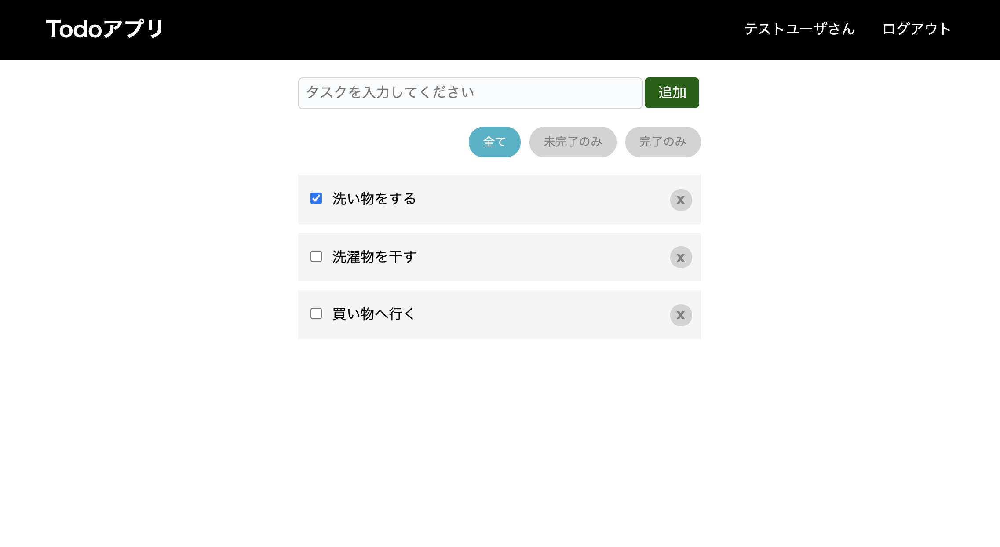
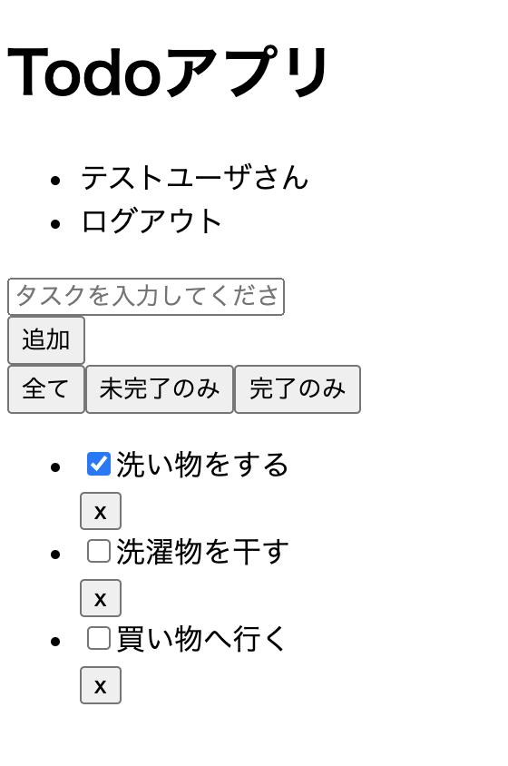

# ページ外観の作成

ToDoページの外観を作成します。

## ToDoページの表示

まず、フロントエンドのアプリでデザインモックと同様のページを表示できることを確認します。

前述のとおり、Todoアプリのデザインモックは`spa-restapi-handson/design-mock`に配置しており、その中の`todo.html`と`todo.css`がTodoページのデザインモックになります。デザインモックを確認すると、以下のような画面デザインになっています。



現時点では`App`コンポーネントのみ作成されており、`<h1>Hello, world</h1>`を返しています。これを置き換え、デザインモックのHTMLと同等のReact要素を返すようにします。デザインモックからHTMLのbody部を抽出し、JSXでReact要素を定義します。

その前に、確認をしやすいようにアプリを起動しておきます。起動中はファイルの状態が監視され、ファイルが更新されると即座にコンパイルしてページに反映してくれるため、エラーがあった場合にもすぐに確認することができます。

アプリを起動するには、起動テストの時と同様、次のコマンドを実行します。

```
$ npm start
```

アプリが起動したら、`App`にJSXを記述していきます。HTMLを確認しながら順にJSXを記述していくこともできますが、ここでは、デザインモックのHTMLのbody部をそのまま持ってきて同じように表示できることをまず確認してみます。また、HTMLをそのまま持ってきた際に、HTMLとJSXの違いによりいくつかのエラーが発生しますので、それについても確認していきます。

それでは、ToDoページのデザインモックである`todo.html`のbody部をコピーして、`App`のJSXとしてそのまま持ってきます。

```jsx
function App() {
  return (
    <header class="PageHeader_header">
    ...
    </div>
  );
}
```

すると、次のようなエラーが発生します。

```
Failed to compile.

./src/App.tsx
  Line 67:2:  Parsing error: JSX expressions must have one parent element
```

エラーメッセージを確認すると、JSXは必ず1の親要素を持つ必要がある、とあります。これは、JSXではトップレベルの要素として複数の要素を返すことはできず、必ず1つの要素として返さなければいけないためです。デザインモックのHTMLをそのまま持ってくると、`header`タグと`div`タグがトップレベルで並んだ状態になるため、このルールに違反してしまいます。ダミーの親要素として`<div>`等で囲って返すといったこともできますが、意味を持たない余分な要素をページに出力することになってしまいます。そのため、ここではフラグメントというReactが提供するコンポーネントを使用します。次のようにReact要素のトップレベルで使用することで、出力結果には影響させずに、複数の要素を1つの要素として返すことができます。

```jsx
function App() {
  return (
    <React.Fragment>
      <header class="PageHeader_header">
      ...
      </div>
    </React.Fragment>
  );
}
```

このエラーを解消すると、次のようなエラーが発生します。

```
Failed to compile.

/Users/xxx/work/todo-app/frontend/src/App.tsx
TypeScript error in /Users/xxx/work/todo-app/frontend/src/App.tsx(15,15):
Type '{ children: Element[]; class: string; }' is not assignable to type 'DetailedHTMLProps<HTMLAttributes<HTMLElement>, HTMLElement>'.
  Property 'class' does not exist on type 'DetailedHTMLProps<HTMLAttributes<HTMLElement>, HTMLElement>'.  TS2322

    13 |   return (
    14 |     <React.Fragment>
  > 15 |       <header class="PageHeader_header">
       |               ^
    16 |         <h1 class="PageHeader_title">Todoアプリ</h1>
    17 |         <nav>
    18 |           <ul class="PageHeader_nav">

```

エラーメッセージを確認すると、`class`プロパティはその型に存在しない、とあります。これは、JSXでは`class`属性が無いためです。このように、JSXはHTMLと完全に同じというわけではないため、属性がそのまま使えない場合があります。JSXでは、`class`属性と同等の属性が`className`属性として提供されているため、次のように`className`属性を使うように修正します。

```jsx
function App() {
  return (
    <React.Fragment>
      <header className="PageHeader_header">
      ...
      </div>
    </React.Fragment>
  );
}
```

このエラーを解消すると、最後に次のようなエラーが発生します。

```
/Users/xxx/work/todo-app/frontend/src/App.tsx
TypeScript error in /Users/xxx/work/todo-app/frontend/src/App.tsx(44,70):
Type 'string' is not assignable to type 'boolean | undefined'.  TS2322

    42 |             <div className="TodoItem_todo">
    43 |               <label>
  > 44 |                 <input type="checkbox" className="TodoItem_checkbox" checked="checked" />
       |                                                                      ^
    45 |                 <span>洗い物をする</span>
    46 |               </label>
    47 |             </div>
```

これは、JSXでは`checked`属性には`boolean`値を設定する必要があるためです。

JSXでは、中括弧で囲うことで式を埋め込むことができますので、`"checked"`と同等である`true`を設定するよう、次のように修正します。（参考：[React - JSXに式を埋め込む](https://ja.reactjs.org/docs/introducing-jsx.html#embedding-expressions-in-jsx)）

```html
<input type="checkbox" className="TodoItem_checkbox" checked={true} />
```

ちなみに、スクリプトを実行したタイミングでエラーになるのではなく、このようにコンパイルされるタイミングでエラーを検知してくれるのは、型を利用できるTypeScriptのメリットでもあります。

これらのエラーを解消した後、`App`は次のようになります。

`src/App.tsx`
```jsx
import React from 'react';

function App() {
  return (
    <React.Fragment>
      <header className="PageHeader_header">
        <h1 className="PageHeader_title">Todoアプリ</h1>
        <nav>
          <ul className="PageHeader_nav">
            <li>テストユーザさん</li>
            <li>ログアウト</li>
          </ul>
        </nav>
      </header>
      <div className="TodoBoard_content">
        <div className="TodoForm_content">
          <form className="TodoForm_form">
            <div className="TodoForm_input">
              <input type="text" placeholder="タスクを入力してください" />
            </div>
            <div className="TodoForm_button">
              <button type="button">追加</button>
            </div>
          </form>
        </div>
        <div className="TodoFilter_content">
          <button className="TodoFilter_buttonSelected">全て</button>
          <button className="TodoFilter_buttonUnselected">未完了のみ</button>
          <button className="TodoFilter_buttonUnselected">完了のみ</button>
        </div>
        <ul className="TodoList_list">
          <li className="TodoItem_item">
            <div className="TodoItem_todo">
              <label>
                <input type="checkbox" className="TodoItem_checkbox" checked={true} />
                <span>洗い物をする</span>
              </label>
            </div>
            <div className="TodoItem_delete">
              <button className="TodoItem_button">x</button>
            </div>
          </li>
          <li className="TodoItem_item">
            <div className="TodoItem_todo">
              <label>
                <input type="checkbox" className="TodoItem_checkbox" />
                <span>洗濯物を干す</span>
              </label>
            </div>
            <div className="TodoItem_delete">
              <button className="TodoItem_button">x</button>
            </div>
          </li>
          <li className="TodoItem_item">
            <div className="TodoItem_todo">
              <label>
                <input type="checkbox" className="TodoItem_checkbox" />
                <span>買い物へ行く</span>
              </label>
            </div>
            <div className="TodoItem_delete">
              <button className="TodoItem_button">x</button>
            </div>
          </li>
        </ul>
      </div>
    </React.Fragment>
  );
}

export default App;
```

この状態で、エラーは発生せずにページが表示されますが、以下のようにスタイルが適用されていない状態となっています。



`App`ではCSSファイルを取り込む実装をしていないため、スタイルが適用されていない状態になっています。そのため、次はCSSファイルを取り込む実装を追加していきます。

## CSSファイルの作成

Reactでは、スタイルの記述方法がいくつか提供されていますが、ここではデザインモックのCSSファイルを使うために、`className`属性とCSSファイルを使ってスタイルを定義します。（参考：[React - CSSとスタイルの使用](https://ja.reactjs.org/docs/faq-styling.html)）

CRAに含まれる[webpack](https://webpack.js.org/)では、`import`を使用してCSSファイルを読み込むことが出来るため、その方法でコンポーネントにCSSファイルを読み込みます。（参考：[CRA - Adding a Stylesheet](https://create-react-app.dev/docs/adding-a-stylesheet)）

`App`用のCSSのファイルとして、`App.css`を作成します。CSSファイルの中身は、ToDoページのデザインモックのCSSをそのまま持ってきます。

`src/App.css`
```css
body {
  margin: 0;
}

.PageHeader_header {
  display: flex;
  justify-content: space-between;
  align-items: center;
  padding: 0 5%;
  border-bottom: solid 1px black;
  background: black;
}
.PageHeader_title {
  color: white;
  font-size: 1.5rem;
}
.PageHeader_header a {
  text-decoration: none;
}
.PageHeader_nav {
  display: flex;
  list-style: none;
}
.PageHeader_nav li {
  margin-left: 30px;
  color: white;
}
.PageHeader_nav a {
  color: white;
}
.PageHeader_nav button,
.PageHeader_nav button:active,
.PageHeader_nav button:hover
{
  cursor: pointer;
  border: 0;
  background-color: transparent;
  color: white;
}

.TodoBoard_content {
  margin-top: 10px;
  width: 40%;
  padding: 0 30%;
}

.TodoForm_content {
  margin-top: 20px;
  margin-bottom: 20px;
}
.TodoForm_form {
  width: 100%;
  display: flex;
  justify-content: space-between;
}
.TodoForm_input {
  width: 86%;
}
.TodoForm_input input{
  float: left;
  width: 95%;
  border-radius: 5px;
  padding: 8px;
  border: solid 1px lightgray;
  background-color: #fafbfc;
  font-size: 16px;
  outline: none;
}
.TodoForm_input input:focus {
  background-color: white;
}
.TodoForm_button {
  text-align: center;
  width: 14%;
}
.TodoForm_button button {
  height: 35px;
  cursor: pointer;
  line-height: 1;
  font-size: 1rem;
  color: white;
  background-color: darkgreen;
  border-radius: 5px;
  padding: 0 15px;
  border: none;
  vertical-align: middle;
}
.TodoForm_button button:hover {
  background-color: green;
}

.TodoFilter_content {
  text-align: right;
}
.TodoFilter_content button{
  margin-left: 5px;
}
.TodoFilter_buttonSelected {
  background-color: #31b3c7;
  border-width: 0;
  color: #fff;
  cursor: pointer;
  justify-content: center;
  padding: 7px 16px;
  text-align: center;
  white-space: nowrap;
  border-radius: 290486px;
  outline: none;
}
.TodoFilter_buttonUnselected {
  background-color: lightgray;
  border-width: 0;
  color: gray;
  cursor: pointer;
  justify-content: center;
  padding: 7px 16px;
  text-align: center;
  white-space: nowrap;
  border-radius: 290486px;
  outline: none;
}

.TodoList_list {
  list-style: none;
  padding: 0;
  margin: 20px 0;
}

.TodoItem_item {
  padding: 15px 10px;
  background: whitesmoke;
  margin-bottom: 10px;
}
.TodoItem_todo {
  float: left;
  text-align: left;
}
.TodoItem_checkbox {
  margin-right: 7px;
  outline: none;
}
.TodoItem_delete {
  text-align: right;
}
.TodoItem_button {
  font-size: 17px;
  font-weight: bold;
  border: none;
  color: grey;
  background: lightgrey;
  border-radius: 100%;
  width: 25px;
  height: 25px;
  line-height: 20px;
  cursor: pointer;
  outline: none;
}
```

作成したCSSファイルを`App`コンポーネントに取り込むため、`App.tsx`に以下の`import`を追加します。

`src/App.tsx`
```js
import './App.css';
```

ページの表示内容を確認し、スタイルが適用されてデザインモックと同等の表示内容になっていることを確認します。


これで、ページの作成は完了です。